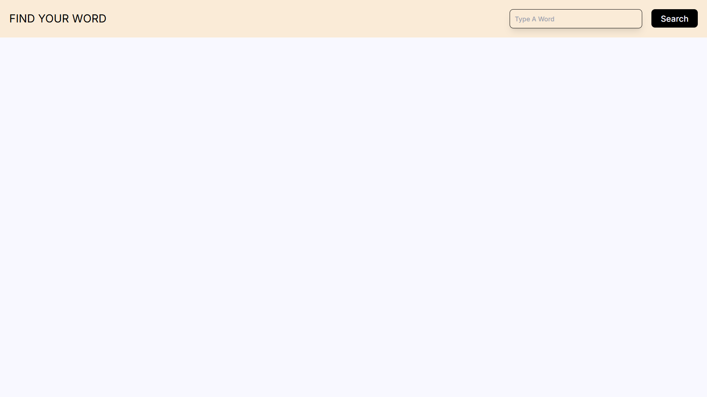
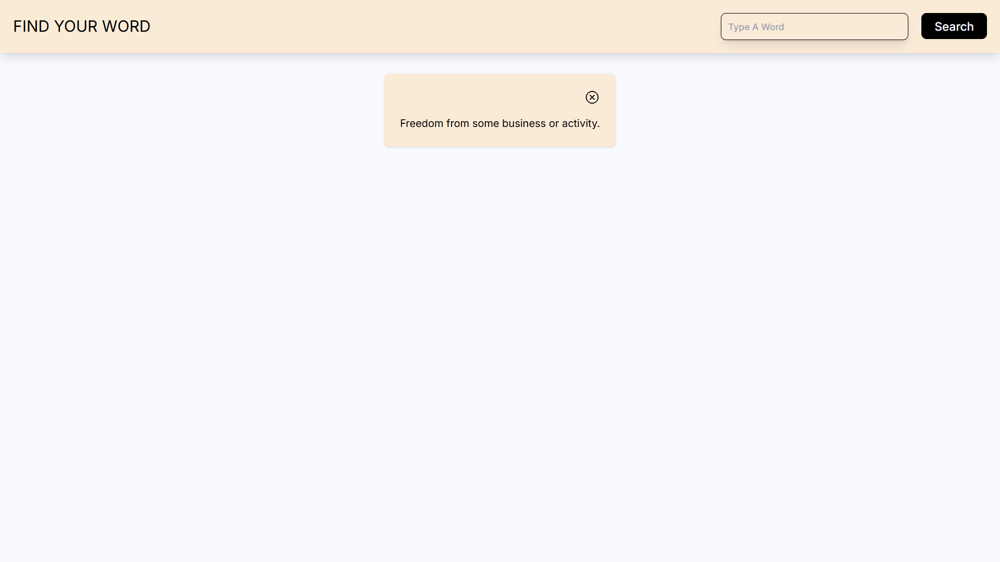

# Find your word

Questa applicazione web, consente all'utente di cercare una parola in inglese e di leggerne il suo significato. Ho deciso di riempire la barra di navigazione con il form di ricerca, per dare uno stile diverso dagli altri layout e tenere la card dentro il main dell'interfaccia. Ho deciso di usare un colore primary che ricordasse il colore delle pagine del dizionario

# Tecnologie utilizzate
- NextJS
- ReactJS
- Tailwind CSS
- Tailwind Flowbite React
- Axios
- Zustand
- Free Dictionary API
- Tanstack / React-Query

# Immagini:

